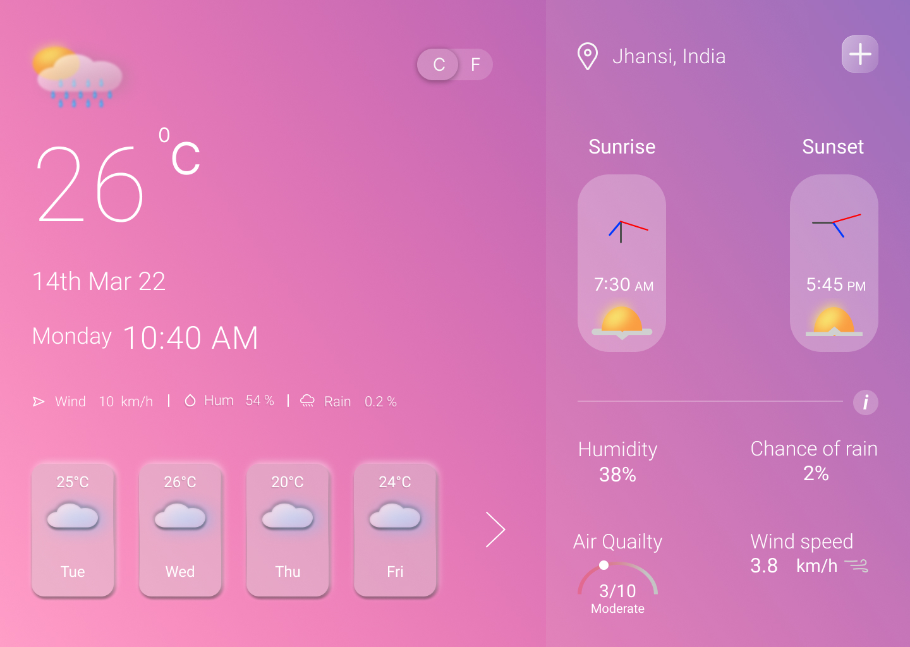

# Weather Widget

## Task descrition

Your task is to implement a design from Figma called "Main page". You could also use of the variants from "Themes".

## Figma design link

[Figma design link is here](<https://www.figma.com/file/29W66cZmrZcdOkNZ19T7vz/Weather-App-UI-(Community)?type=design&node-id=6-1925&t=WpBN6HSwhw4BnaFb-0>)

## Image design

Click to display final design ("main page")

## Project structure

`index.html` - contains HTML code

`assets/design` - contains final design template

`assets/images` - contains memoji

`styles` - contains CSS code

## How to run

### Running by simply opening index.html in browser

- Open file index.html in browser
  - In Visual Studio Code right click in index.html -> Copy Path
  - Open browser and paste copied path as an url (i.e `D://Proejcts/intro-to-web-dev-tasks/packages/classtask-YuliaVorman/index.html`)
- Enjoy

Why not to use that approach - every time you're making changes you have to reload your page manually

Why to use - simply you don't want to deal with NPM and JavaScript or there might be any issues currently with it

### Running using NPM and JavaScript (Preferred)

- Open console
- In console navigate to the project root (`./intro-to-web-dev-tasks`)
- Run `npm install`
- Navigate to the project `cd packages/classtask-YuliaVorman`
- Run `npm run serve`
- Open browser
- Navigate to `http://localhost:8080/`
- Enjoy

Why to use - every time you make a change your page is automatically reloaded and your changes applied

Why not to use - you don't want to deal with NPM and JavaScript or there might be any issues currently with it
