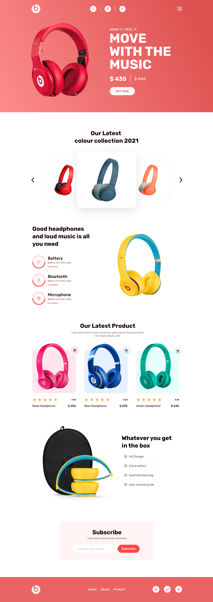

# Hometask Beats Landing Page

## Task descrition

You task is to implement Figma design using DOM API only. The main goal is to implement it close to design, not pixel-perfect.

In this task you need to implement 2 screens (Desktop and Mobile). 

Please choose 768px as a Desktop breakpoint (screen width less than 768px is a Mobile view). 

Please be flexible and do not stick completly to design in these cases:

- Font used in Figma is a paid or not available on the internet - try to replace it with a font you would like to. The best practice is just to used standard fonts like Roboto
- Figma elements' dimenstion specified in:
  - real numbers (44.21) --> round to closest integer (46 or 44)
  - odd number (11, 67) --> round to closes even number or to the closes pow of 2 (12, 64)
  - visually margins left and right are equal to each other, but in numbers they are i.e 51 and 49. Choose one value, better odd number (24, 12, etc)

## Evaluation criteria - LR Students

Maximum score - **10** consists of:

- Render "Navigation" section for Desktop and Mobile screens = **1**
- Render "Hero Area" section for Desktop and Mobile screens = **1**
- Render "Clour" section for Desktop and Mobile screens = **1**
- Render "Feature" section for Desktop and Mobile screens = **1**
- Render "Product" section for Desktop and Mobile screens = **1**
- Render "Boxing" section for Desktop and Mobile screens = **1**
- Render "Main Cta" section for Desktop and Mobile screens = **1**
- Render "Futear" section for Desktop and Mobile screens = **1**
- [Mobile-first design approach](https://www.freecodecamp.org/news/taking-the-right-approach-to-responsive-web-design/) - **2**

## Figma design link

[Figma design link is here](https://www.figma.com/file/VL15V8L5rCjiSxmWJP7NhX/Beats?type=design&node-id=0%3A1&t=1twb9rOK1jf4ucBW-1)

## Image design

Click to display final design (Desktop)

Click to display final design (Mobile)

## Project structure

`index.html` - contains HTML code

`assets/design` - contains final design template

`assets/images` - contains images

`assets/icons` - contains icons

`styles` - contains CSS code

## How to run

### Running by simply opening index.html in browser

- Open file `index.html` on browser
  - In Visual Studio Code right click in index.html -> Copy Path
  - Open browser and paste copied path as an url (i.e `D://Proejcts/intro-to-web-dev-tasks/packages/classtask-YuliaVorman/index.html`)
- Enjoy

Why not to use that approach - every time you're making changes you have to reload your page manually

Why to use - simply you don't want to deal with NPM and JavaScript or there might be any issues currently with it

### Running using NPM and JavaScript (Preferred)

- Open console
- In console navigate to the project root (`./intro-to-web-dev-tasks`)
- Run `npm install`
- Navigate to the project `cd packages/classtask-YuliaVorman`
- Run `npm run serve`
- Open browser
- Navigate to `http://localhost:8080/`
- Enjoy

Why to use - every time you make a change your page is automatically reloaded and your changes applied

Why not to use - you don't want to deal with NPM and JavaScript or there might be any issues currently with it
